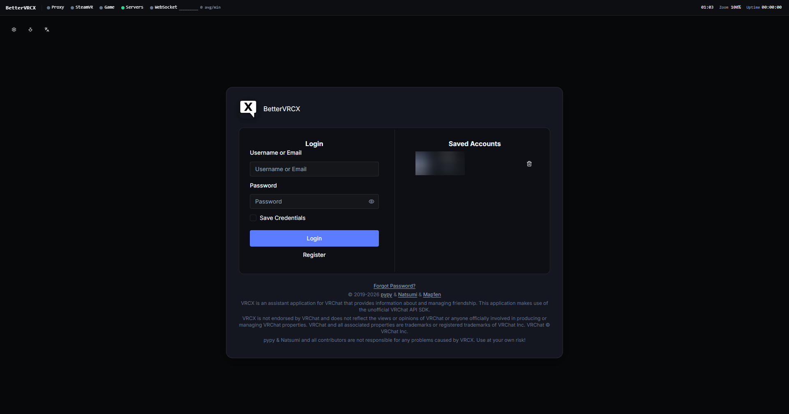
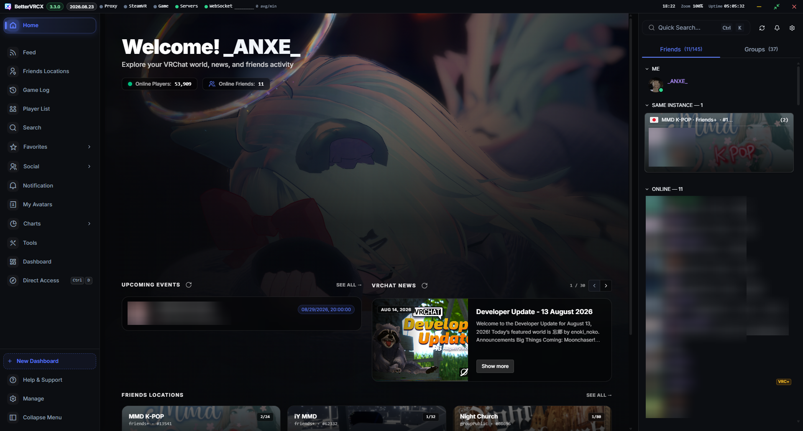
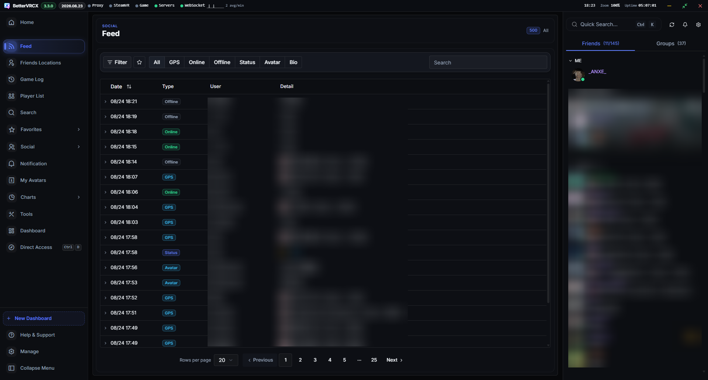
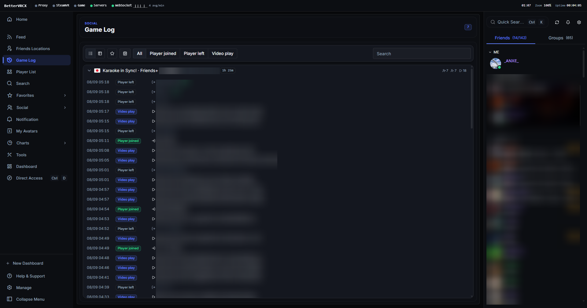
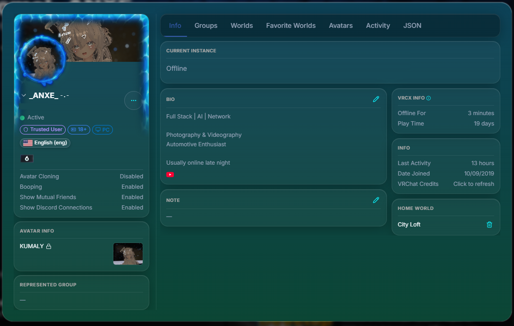
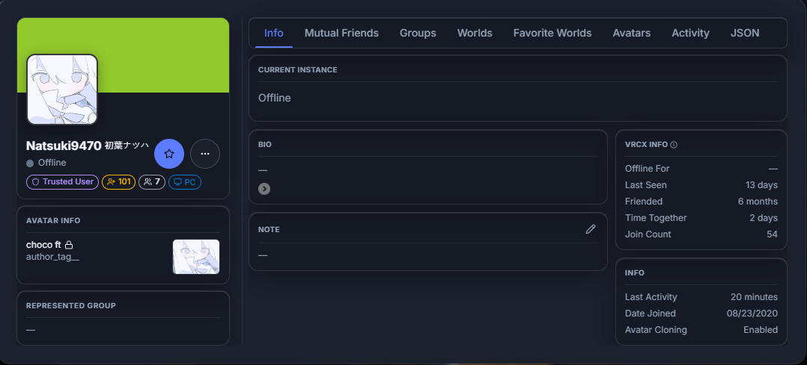
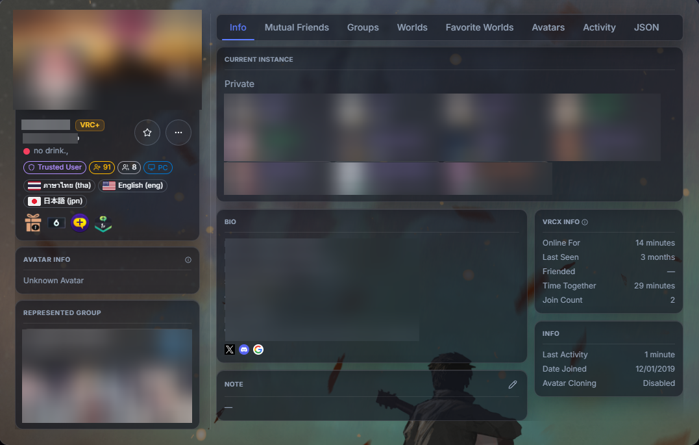
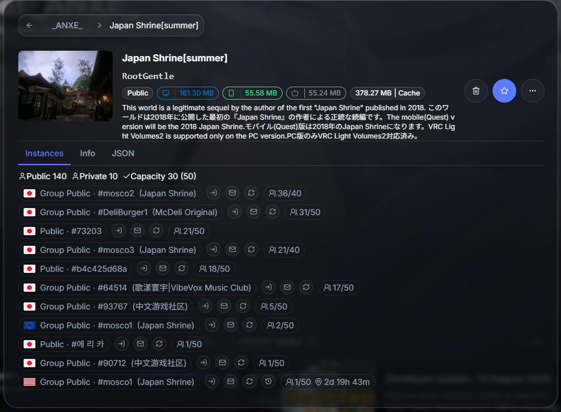
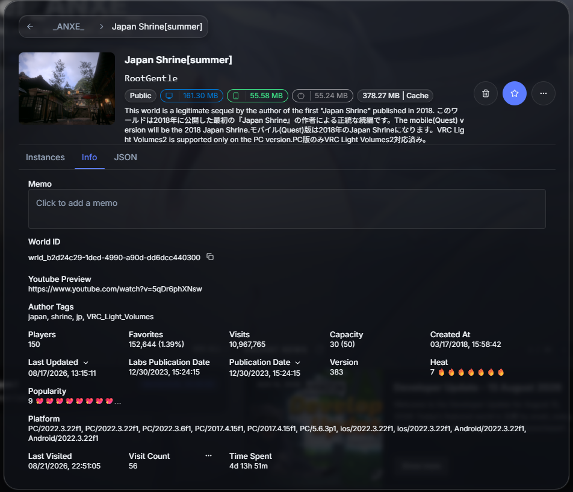

#  </img> BetterVRCX

  
  
  

  

| [English](../README.md) | [ภาษาไทย](./README.th.md) | [日本語](./README.jp.md) | [简体中文](./README.zh_CN.md) | [繁體中文](./README.zh_TW.md) | [Italiano](./README.it.md) | [Русский](./README.ru_RU.md) | **Español** | [Polski](./README.pl.md) | [Français](./README.fr.md) | [Magyar](./README.hu.md) |

BetterVRCX es una aplicación asistente/compañera para VRChat que proporciona información y te ayuda a realizar varias tareas relacionadas con VRChat de una manera más conveniente que depender únicamente del cliente de VRChat (escritorio o VR) o del sitio web. También incluye algunas otras características interesantes que se describen a continuación.

# Empezando

Descarga e instala el último instalador (`BetterVRCX_Setup.exe`) desde [aquí](https://github.com/awakenginexe/BetterVRCX/releases/latest).

# Características

- :family: Gestión de listas de amigos, mundos y avatares
    - Administra tu lista de amigos, listas de mundos/grupos/avatares fuera de VRChat.
    - Monitorea la actividad de mundos/avatares de tus amigos y verifica su estado en línea.
    - Lleva un registro de cuándo los agregaste por primera vez y cuándo los viste por última vez.
    - Ve cuánto tiempo han pasado juntos en mundos y cuántas veces.
    - Lleva un registro de los cambios de nombre de amigos.
    - Guarda notas para recordar cómo los conociste.
- :electric_plug: Inicia automáticamente aplicaciones cuando inicias VRChat
    - Puedes configurar BetterVRCX para iniciar otras aplicaciones cuando inicias VRChat.
    - Por ejemplo, podrías hacer que BetterVRCX inicie una aplicación OSC o una aplicación de cambio de voz cuando se abra VRChat.
- :mag: Busca avatares, usuarios, mundos y grupos
- :earth_americas: Crea una lista de favoritos de mundos local y sin restricciones
- :camera: Almacena datos de mundos en las fotos que tomas en el juego, para que puedas recordar ese mundo donde tomaste esas fotos geniales hace como... 6 meses.
- :bell: Monitorea/responde a notificaciones
    - Puedes enviar/recibir invitaciones y solicitudes de amistad desde BetterVRCX, así como ver la información de la instancia de las invitaciones que recibes.
- :scroll: Ve estadísticas/jugadores de tu instancia actual
- :tv: Ve los enlaces a videos que se están reproduciendo en el mundo en el que estás, así como varios otros datos registrados.
- :bar_chart: Presencia mejorada en Discord
    - Opcionalmente, puedes mostrar más información sobre tu instancia actual en Discord.
    - Integración de mundos para mundos populares como PyPyDance, LSMedia, Movies&Chill y VRDancing.
    - Esto incluye la miniatura del mundo, nombre, ID de instancia y cantidad de jugadores, dependiendo de tu configuración y si el lobby es privado. ¡También puedes agregar un botón de unirse para lobbies públicos!
- :crystal_ball: Superposición de VR con feed en vivo configurable de todos los eventos/notificaciones soportados
- :outbox_tray: Sube imágenes de avatares/mundos sin Unity
- :page_facing_up: Administra y edita detalles de avatares/mundos subidos sin Unity
- :skull: Reinicia automáticamente y únete a la última instancia cuando VRChat se crashea
- :left_right_arrow: Exporta/importa grupos de favoritos

## Miscelánea

- ¿Quieres un nuevo aspecto para BetterVRCX? Revisa [Temas](https://github.com/vrcx-team/VRCX/wiki/Themes)
- Consulta [Construir desde el código fuente](https://github.com/vrcx-team/VRCX/wiki/Building-from-source) para instrucciones sobre cómo construir BetterVRCX desde el código fuente.
- Para una guía sobre cómo ejecutar BetterVRCX en Linux, consulta [aquí](https://github.com/vrcx-team/VRCX/wiki/Running-VRCX-on-Linux)

# Capturas de pantalla

<h3>Iniciar sesión</h3>

<h3>Inicio</h3>

<h3>Feed</h3>

<h3>Registro de juego</h3>

<h3>Información del usuario</h3>

<h4>Yo</h4>

<h4>Amigo</h4>

<h4>Amigo VRC+</h4>

<h3>Mundo</h3>

<h4>Instancia</h4>

<h4>Información</h4>

## ¿BetterVRCX está en contra de los TOS de VRChat?

**No.**

BetterVRCX es una herramienta externa que utiliza la API de VRChat para proporcionar las características que ofrece.

No modifica el juego de ninguna manera, solo utiliza la API de manera responsable para proporcionar las características que ofrece. No es un mod, ni un truco, ni ninguna otra forma de modificación del juego.

Para ver la postura de VRChat sobre el uso de la API, consulta el canal #faq en el Discord de VRChat.

---

BetterVRCX no está respaldado por VRChat y no refleja las opiniones o puntos de vista de VRChat ni de nadie oficialmente involucrado en la producción o gestión de las propiedades de VRChat. VRChat y todas las propiedades asociadas son marcas comerciales o marcas registradas de VRChat Inc. VRChat © VRChat Inc.
