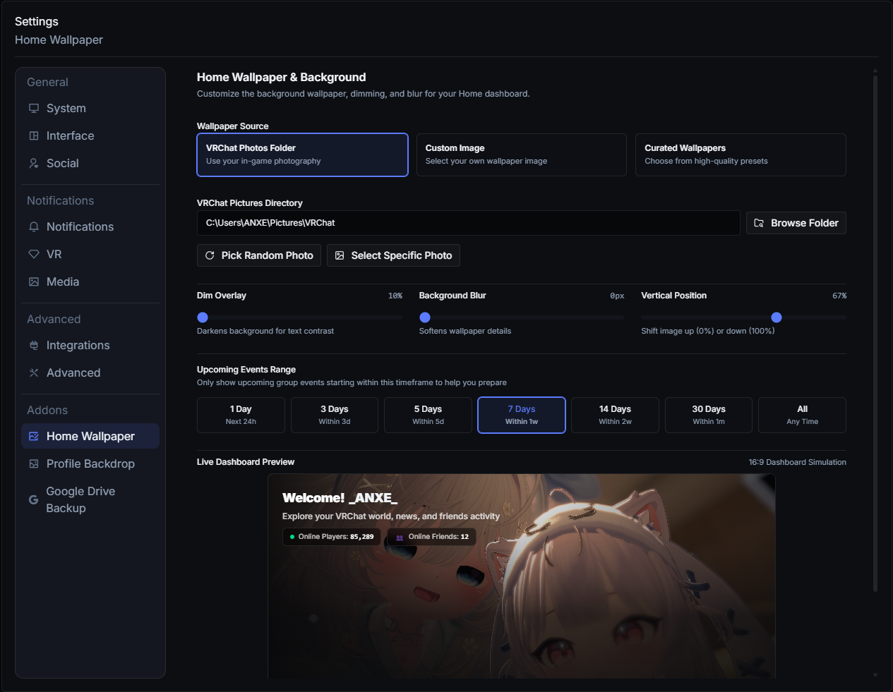
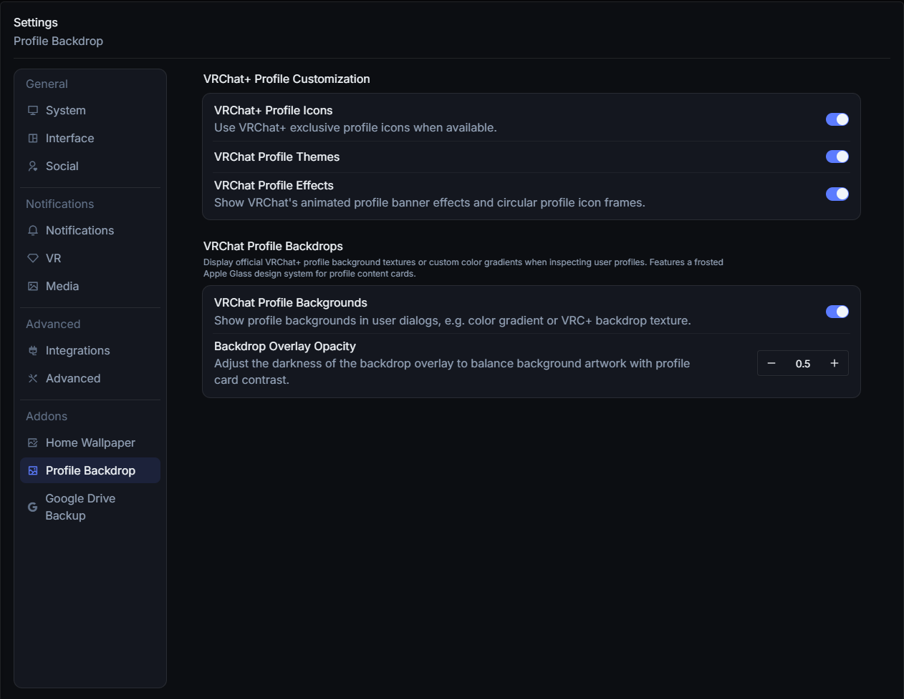
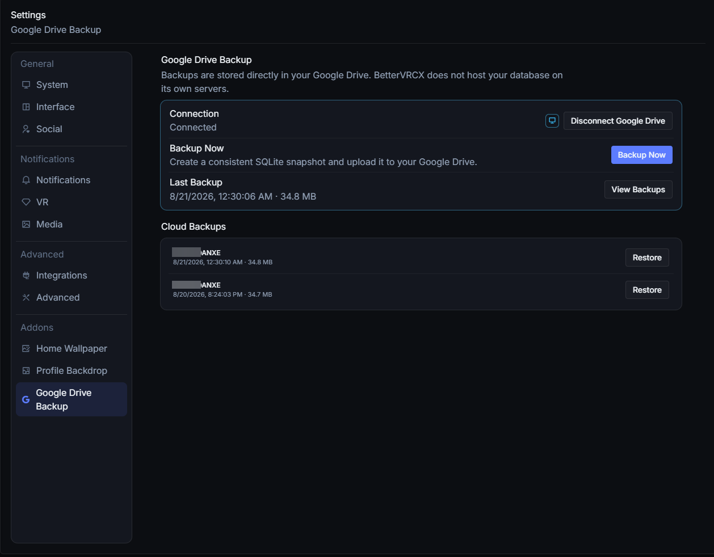

#  </img> BetterVRCX

  
  
  

  

| [English](../README.md) | [ภาษาไทย](./README.th.md) | [日本語](./README.jp.md) | [简体中文](./README.zh_CN.md) | [繁體中文](./README.zh_TW.md) | [Italiano](./README.it.md) | [Русский](./README.ru_RU.md) | [Español](./README.es.md) | [Polski](./README.pl.md) | **Français** | [Magyar](./README.hu.md) |

BetterVRCX est une application assistante/complémentaire pour VRChat qui fournit des informations et vous aide à accomplir diverses tâches liées à VRChat de manière plus pratique que de compter uniquement sur le client VRChat classique (desktop ou VR) ou le site web seul. Il comprend également quelques autres fonctionnalités intéressantes décrites ci-dessous.

# Pour Commencer

Téléchargez et exécutez le dernier programme d'installation (`BetterVRCX_Setup.exe`) [ici](https://github.com/awakenginexe/BetterVRCX/releases/latest).

# Fonctionnalités

- :family: Gestion des listes d'amis, de mondes et d'avatars
    - Gérez vos listes d'amis, vos listes de mondes/groupes/avatars en dehors de VRChat.
    - Surveillez l'activité de monde/avatar de vos amis et vérifiez leur statut en ligne.
    - Suivez quand vous les avez ajoutés pour la première fois et quand vous les avez vus pour la dernière fois.
    - Voyez combien de temps vous avez passé ensemble dans les mondes et combien de fois.
    - Gardez une trace des changements de nom de vos amis.
    - Enregistrez des notes pour vous souvenir de comment vous les avez rencontrés.
- :electric_plug: Lancement automatique d'applications lorsque vous démarrez VRChat
    - Vous pouvez configurer BetterVRCX pour lancer d'autres applications lorsque vous démarrez VRChat.
    - Par exemple, vous pourriez avoir BetterVRCX qui lance une application OSC ou une application de modification de voix lorsque VRChat s'ouvre.
- :mag: Recherche d'avatars, d'utilisateurs, de mondes et de groupes
- :earth_americas: Créez une liste de favoris de mondes locale et sans restrictions
- :camera: Stockez les données du monde dans les images que vous prenez en jeu, afin de vous souvenir de ce monde où vous avez pris ces superbes photos il y a... 6 mois !
- :bell: Surveillez/Répondez aux notifications
    - Vous pouvez envoyer/recevoir des invitations et des demandes d'amis depuis BetterVRCX, ainsi que voir les infos d'instance des invitations que vous recevez.
- :scroll: Voyez les stats/joueurs de votre instance actuelle
- :tv: Voyez les liens vers les vidéos en cours de lecture dans le monde où vous vous trouvez, ainsi que diverses autres données enregistrées.
- :bar_chart: Amélioration de Discord Rich Presence
    - Vous pouvez afficher en option plus d'informations sur votre instance actuelle dans Discord.
    - Intégration pour des mondes populaires comme PyPyDance, LSMedia, Movies&Chill et VRDancing.
    - Cela inclut la vignette du monde, le nom, l'ID de l'instance et le nombre de joueurs, en fonction de vos paramètres et de la confidentialité du lobby. Vous pouvez également ajouter un bouton pour rejoindre les lobbies publics !
- :crystal_ball: Superposition/Overlay VR avec flux en direct configurable de tous les événements/notifications pris en charge
- :outbox_tray: Téléchargez des images d'avatar/de monde sans Unity
- :page_facing_up: Gérez et éditez les détails des avatars/mondes téléchargés sans Unity
- :skull: Redémarrez automatiquement et rejoignez la dernière instance lorsque VRChat plante
- :left_right_arrow: Exportez/importez des groupes favoris

## Divers

- Vous voulez un nouveau look pour BetterVRCX ? Jetez un œil aux [Thèmes (Themes)](https://github.com/vrcx-team/VRCX/wiki/Themes)
- Consultez [Build à partir de la source (Building from source)](https://github.com/vrcx-team/VRCX/wiki/Building-from-source) pour des instructions sur comment build BetterVRCX à partir de la source.
- Pour un guide sur comment exécuter BetterVRCX sous Linux, consultez [ici](https://github.com/vrcx-team/VRCX/wiki/Running-VRCX-on-Linux)

# Captures d'écran

<h3>Connexion</h3>

<h3>Accueil</h3>

<h3>Flux</h3>

<h3>Infos Utilisateur</h3>

<h4>Moi</h4>

<h4>Ami</h4>

<h3>Monde</h3>

<h4>Instance</h4>

<h4>Infos</h4>

<h3>Modules complémentaires</h3>

<h4>Fond d'écran d'accueil</h4>

<h4>Arrière-plan du profil</h4>

<h4>Sauvegarde Google Drive</h4>

## BetterVRCX enfreint-il les CGU de VRChat ?

**Non.**

BetterVRCX est un outil externe qui utilise l'API VRChat pour fournir les fonctionnalités qu'il propose.

Il ne modifie en aucun cas le jeu, utilisant uniquement l'API de manière responsable pour offrir les fonctionnalités qu'il propose. Ce n'est pas un mod, ni un cheat, ni une autre forme de modification du jeu.

Pour voir la position de VRChat sur l'utilisation de l'API, consultez le canal #faq dans le Discord de VRChat.

---

BetterVRCX n'est pas approuvé par VRChat et ne reflète pas les opinions de VRChat ni de quiconque impliqué officiellement dans la production ou la gestion des propriétés de VRChat. VRChat et toutes les propriétés associées sont des marques commerciales ou des marques déposées de VRChat Inc. VRChat © VRChat Inc.
